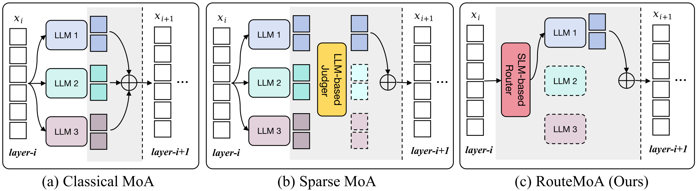

# RouteMoA

[English](README.md) | 简体中文

**[ACL 2026] RouteMoA: Dynamic Routing without Pre-Inference Boosts Efficient Mixture-of-Agents**

欢迎来到 **RouteMoA** 的官方仓库 ([论文链接](https://arxiv.org/abs/2601.18130))。本项目提出了一种高效的动态路由机制，旨在不依赖预推理（Pre-Inference）步骤的情况下，大幅提升混合智能体（Mixture-of-Agents, MoA）架构的效率与性能。

<p align="center">
  
  <br>
  <em>Concept comparison between our RouteMoA and previous MoA-based methods.</em>
</p>

---

## 目录
- [RouteMoA](#routemoa)
  - [目录](#目录)
  - [环境安装](#环境安装)
  - [快速开始——小模型池](#快速开始小模型池)
    - [1. 部署 LLM 模型](#1-部署-llm-模型)
    - [2. 启动 RouteMoA 服务](#2-启动-routemoa-服务)
    - [3. 模型评测](#3-模型评测)
  - [快速开始——大模型池](#快速开始大模型池)
    - [1. 配置 API 访问](#1-配置-api-访问)
    - [2. 启动服务](#2-启动服务)
    - [3. 模型评测](#3-模型评测-1)
  - [路由模型训练](#路由模型训练)
  - [致谢](#致谢)

---

## 环境安装

我们强烈建议使用 `conda` 来创建一个隔离的运行环境。

> **系统要求：** 我们高度建议使用 Linux (x86_64) 操作系统。本指南基于 Ubuntu 22.04 编写，暂不提供对其他操作系统的官方支持。

```bash
conda create -n YOUR_ENV_NAME python=3.10 -y
conda activate YOUR_ENV_NAME

# 安装 OpenCompass 评测框架（用于小模型池实验）
cd opencompass
pip install -e .

# 安装 EMoA 核心模块（小模型池）
cd ../emoa
pip install -e .

# 安装 EMoA 大模型池模块
cd ../emoa_large
pip install -e .
```

---

## 快速开始——小模型池

### 1. 部署 LLM 模型

我们建议首先将需要的大语言模型权重下载到本地。我们在实验中使用了 5 张 NVIDIA A800 80GB 显卡，为了保证实验的可复现性，**我们强烈建议为每个模型单独分配一张显存超过 70GB 的高性能 NVIDIA 显卡。**

设置本地权重存放目录：
```bash
mkdir -p </path/to/your/local/checkpoint/folder>
```

安装 HuggingFace CLI 下载工具：
```bash
pip install -U huggingface_hub
```

从 HuggingFace 下载所需的模型：
```bash
# 下载医疗领域模型
huggingface-cli download ContactDoctor/Bio-Medical-Llama-3-8B \
  --token <your-huggingface-token> \
  --local-dir </path/to/your/local/checkpoint/folder>/Bio-Medical-Llama-3-8B

# 下载 Qwen 系列模型
huggingface-cli download Qwen/Qwen2.5-Coder-7B-Instruct \
  --local-dir </path/to/your/local/checkpoint/folder>/Qwen2.5-Coder-7B-Instruct

huggingface-cli download Qwen/Qwen2.5-Math-7B-Instruct \
  --local-dir </path/to/your/local/checkpoint/folder>/Qwen2.5-Math-7B-Instruct

# 下载 Gemma 和 Ministral 模型
huggingface-cli download google/gemma-2-9b-it \
  --token <your-huggingface-token> \
  --local-dir </path/to/your/local/checkpoint/folder>/gemma-2-9b-it

huggingface-cli download mistralai/Ministral-8B-Instruct-2410 \
  --local-dir </path/to/your/local/checkpoint/folder>/Ministral-8B-Instruct-2410
```

模型准备完毕后，使用 LMDeploy 启动部署：
```bash
bash lmdeploy.sh
```

### 2. 启动 RouteMoA 服务

接下来，我们需要配置路由模型并启动核心服务。

1. 从 [Google Drive](https://drive.google.com/file/d/1cMntfcUJ6mKf5a2bsgwwWo4ehCLWqAuw/view?usp=drive_link) **下载 Router 检查点（Checkpoint）**。
2. 将下载好的文件放置在本地的 `checkpoints/` 目录下。
3. **下载路由骨干网络** (`mdeberta-v3-base`)，你可以在微软的官方仓库找到它：
   - 模型权重地址：[microsoft/mdeberta-v3-base](https://huggingface.co/microsoft/mdeberta-v3-base)
   - 也可以直接使用命令行下载：
   ```bash
   huggingface-cli download microsoft/mdeberta-v3-base --local-dir </path/to/mdeberta-v3-base>
   ```
4. **更新配置文件** (`emoa/configs/emoa_v2.json`)：
   - 将 `router_pth_path` 修改为你下载的 Router Checkpoint 的**绝对路径**。
   - 将 `router_backbone` 修改为 `mdeberta-v3-base` 文件夹的**绝对路径**。

现在，可以启动服务了：
```bash
conda activate YOUR_ENV_NAME

# 启动 EMoA 服务
python3 -m emoa.serve.app_v2 --config emoa/configs/emoa_v2.json --host 0.0.0.0 --port 10666

# 启动 SMoA 服务
python3 -m emoa.serve.smoa --config emoa/configs/smoa.json --host 0.0.0.0 --port 10667
```

### 3. 模型评测

我们使用 OpenCompass 来评估 EMoA 服务的表现。

首先，运行推理任务：
```bash
conda activate YOUR_ENV_NAME
opencompass examples/eval_emoa.py -r latest --mode infer --dump-eval-details
```

推理完成后，运行评估命令来计算最终得分：
```bash
opencompass examples/eval_emoa.py -r latest --mode eval --dump-eval-details
```

如果你需要统计 API 的使用成本（Cost）和延迟（Latency），可以直接运行我们提供的脚本：
```bash
cd opencompass
python bill_stat.py
```

> **关于可复现性的说明：** 为了证明我们实验的可复现性，我们在[这里](https://drive.google.com/file/d/1QAIy1lxqvXrPFoQj0g6tjHXMWxowH0Je/view?usp=drive_link)提供了完整的 OpenCompass 实验评估结果（eval result），你可以下载后进行验证和查看。

---

## 快速开始——大模型池

大模型池实验通过调用外部 LLM API（如 DeepSeek、Qwen 等）来实现，无需在本地部署模型。相关代码均位于 `emoa_large/` 目录下。

### 1. 配置 API 访问

**a) 安装依赖：**
```bash
cd emoa_large
pip install -e .
```

**b) 填写 API 配置**（`emoa_large/configs/api_info.csv`）：

打开该文件，将每个模型对应的 `YOUR_API_BASE_URL` 和 `YOUR_API_KEY` 替换为你实际的 API 端点和密钥。该文件采用标准的 OpenAI 兼容格式：

```
model,model_name,model_id,input_price,output_price,api_type,api_base,api_key
deepseek-ai/DeepSeek-V3-0324,deepseek-v3-0324,,0.28,1.14,openai,https://api.deepseek.com/v1,YOUR_KEY
...
```

你无需配置全部 15 个模型——只需配置你打算使用的模型，并在相应的 config JSON 文件中更新 `candidate_models` 列表即可。

**c) 下载路由模型权重**（仅 RouteMoA 需要）：

从 [Google Drive](YOUR_GOOGLE_DRIVE_LINK_HERE) 下载 `router_large.pth`，并将其放置到：
```
emoa_large/weights/router_large.pth
```

**d) 下载路由骨干网络**（`microsoft/mdeberta-v3-base`）：
```bash
huggingface-cli download microsoft/mdeberta-v3-base --local-dir /path/to/mdeberta-v3-base
```
然后将 `emoa_large/configs/routemoa.json` 中的 `router_backbone` 修改为本地路径，或保持 `"microsoft/mdeberta-v3-base"` 以自动从 HuggingFace 下载。

### 2. 启动服务

三种方法均暴露兼容 OpenAI 的 `/v1/chat/completions` 接口。

**MoA**（基线方法）：
```bash
cd emoa_large
python3 -m emoa.serve.app_moa --config configs/moa.json --host 0.0.0.0 --port 10078
```

**RouteMoA**（本文方法）：
```bash
cd emoa_large
python3 -m emoa.serve.app_routemoa --config configs/routemoa.json --host 0.0.0.0 --port 10079
```

**SMoA**（基线方法）：
```bash
cd emoa_large
python3 -m emoa.serve.app_smoa --config configs/smoa.json --host 0.0.0.0 --port 10080
```

可通过以下命令验证服务是否正常运行：
```bash
curl http://localhost:10078/health
```

### 3. 模型评测

> **关于评测方式的说明：** 论文 Table 1 中大模型池实验的结果由内部评测平台生成，该平台目前不对外开放。我们在 `emoa_large/eval/` 中提供了等效的独立评测套件，使用完全开源的工具复现了相同的基准测试、评测指标与实验结果。

`emoa_large/eval/` 目录包含了复现论文大模型池实验所需的全部内容。

**第一步——安装评测依赖：**
```bash
pip install openai
pip install lawrouge          # 用于 RougeMetric（lcsts）
pip install pkuseg nltk       # 用于 GEC F1（nlpcc2018_task2, conll2014）
```

GEC F1 评测还需要安装 `m2scorer`：
```bash
git clone https://github.com/nusnlp/m2scorer
export PYTHONPATH=/path/to/m2scorer:$PYTHONPATH
```

**第二步——对运行中的服务进行推理：**
```bash
cd emoa_large/eval
python inference.py \
    --base_url  http://localhost:10079/v1 \
    --api_key   dummy \
    --model     routemoa \
    --input     benchmark_questions.json \
    --output    predictions_routemoa.json \
    --workers   4
```

**第三步——评估预测结果：**
```bash
python evaluate.py \
    --predictions     predictions_routemoa.json \
    --benchmark       benchmark_questions.json \
    --output          eval_results_routemoa.json \
    --judge_base_url  https://api.openai.com/v1 \
    --judge_api_key   YOUR_OPENAI_KEY \
    --judge_model     gpt-4o
```

脚本会在终端输出各数据集的得分、各类别平均分以及全局平均分。

> **预计算结果：** `emoa_large/eval/` 目录中已提供三种方法的完整推理结果（`moa.json`、`routemoa.json`、`smoa.json`）及跨模型汇总（`summary_all.json`）。详细的基准测试说明和论文结果请参见 `emoa_large/eval/README.md`。

---

## 路由模型训练

我们的路由训练代码构建在 [RouterDC](https://github.com/shuhao02/RouterDC) 框架之上。

你可以参考 RouterDC 仓库中的说明，使用你自己的数据来训练专属的 Router。目前，我们已经开源了训练好的 Router Checkpoint，RouteMoA 完整的训练代码也将在未来逐步开源发布。

---

## 致谢

本项目的成功离不开开源社区的伟大工作。我们衷心感谢以下开源项目：
- [OpenCompass](https://github.com/open-compass/opencompass)
- [RouterDC](https://github.com/shuhao02/RouterDC)
